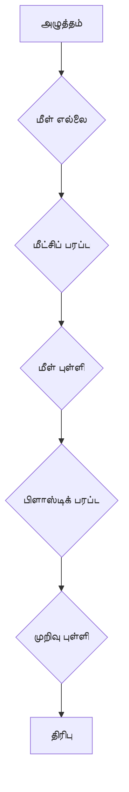

# நீட் இயற்பியல்: திண்ம மற்றும் திரவங்களின் பண்புகள்

## **அறிமுகம்**

நாம் வாழும் உலகில் உள்ள பொருட்கள் திண்மம், திரவம், வாயு என மூன்று முக்கிய நிலைகளில் உள்ளன. ஒவ்வொரு நிலைக்கும் அதன் தனித்துவமான பண்புகள் உள்ளன. இந்த அலகில், நீட் தேர்வுக்கான முக்கியமான திண்ம மற்றும் திரவங்களின் பண்புகள், அவற்றின் கோட்பாடுகள், சூத்திரங்கள் மற்றும் பயன்பாடுகள் பற்றி விரிவாகக் காண்போம். சிறப்பு கவனம், தமிழ்நாட்டில் அரசுப் பள்ளி மாணவர்களுக்குப் புரியும்படி, தமிழ் ஒப்புமைகளுடன் விளக்கப்படும்.

--- 

## பகுதி A: திண்மப் பொருள்களின் பண்புகள்

### 1. மீட்சித்தன்மை (Elasticity)

ஒரு பொருளின் மீது வெளி விசை செயல்படும்போது அதன் வடிவம் அல்லது பருமன் மாறுகிறது. வெளி விசையை நீக்கும்போது, பொருள் தனது அசல் வடிவம் அல்லது பருமனை மீண்டும் அடையும் பண்பு மீட்சித்தன்மை எனப்படும். இந்த பண்பை வெளிப்படுத்தும் பொருட்கள் மீள்பொருட்கள் (Elastic Materials) எனப்படும். எடுத்துக்காட்டாக, ரப்பர் பேண்ட், எஃகு.

**மீள் எல்லை (Elastic Limit):** எந்த ஒரு பொருளுக்கும், ஒரு குறிப்பிட்ட அளவுக்கு மேல் விசையைச் செலுத்தினால், அது தனது அசல் வடிவத்தை மீண்டும் அடையாது. இந்த எல்லை மீள் எல்லை எனப்படும்.

_தமிழ் ஒப்புமை:_ ரப்பர் பேண்டை இழுத்துவிட்டால், அது அதன் அசல் வடிவத்திற்குத் திரும்பும். ஆனால், ஒரு குறிப்பிட்ட அளவுக்கு மேல் இழுத்தால், அது அறுந்துவிடும் அல்லது நிரந்தரமாக நீண்டுவிடும். இதுவே மீள் எல்லை.

### 2. அழுத்தம் (Stress, $\sigma$)

ஒரு பொருளின் மீது செயல்படும் சீரமைக்கும் விசைக்கும் (Restoring Force) அதன் ஒரு அலகு பரப்புக்கும் உள்ள விகிதம் அழுத்தம் எனப்படும்.

$\sigma = \frac{\text{விசை (Force)}}{\text{பரப்பு (Area)}} = \frac{F}{A}$

*   **அலகு:** நியூட்டன்/மீட்டர்² (N/m²) அல்லது பாஸ்கல் (Pascal, Pa).
*   **பரிமாண வாய்பாடு:** $[ML^{-1}T^{-2}]$.

**அழுத்தத்தின் வகைகள்:**
*   **நீள அழுத்தம் (Longitudinal Stress):** நீளவாக்கில் செயல்படும் விசை. (எ.கா: கம்பியை இழுத்தல் அல்லது அமுக்குதல்).
*   **பரும அழுத்தம் (Bulk/Volume Stress):** ஒரு பொருளின் பருமனை மாற்றும் விசை. (எ.கா: ஒரு பந்தின் மீது நீர் அழுத்துதல்).
*   **கத்தரிப்பு அழுத்தம் (Shear/Tangential Stress):** ஒரு பொருளின் வடிவத்தை மாற்றும் விசை, ஆனால் பருமனை மாற்றாதது. (எ.கா: ஒரு புத்தகத்தின் மேல் பக்கத்தை தள்ளுதல்).

### 3. திரிபு (Strain, $\epsilon$)

ஒரு பொருளின் மீது அழுத்தம் செயல்படும்போது அதன் பரிமாணத்தில் ஏற்படும் மாற்றத்திற்கும், அதன் அசல் பரிமாணத்திற்கும் உள்ள விகிதம் திரிபு எனப்படும்.

$\epsilon = \frac{\text{பரிமாணத்தில் மாற்றம்}}{\text{அசல் பரிமாணம்}}$

*   **அலகு:** திரிபுக்கு அலகு இல்லை (பரிமாணமற்றது) ஏனெனில் இது ஒரே வகையான அளவுகளின் விகிதம்.

**திரிபின் வகைகள்:**
*   **நீளத் திரிபு (Longitudinal Strain):** $\epsilon_L = \frac{\Delta L}{L}$ (நீள மாற்றம் / அசல் நீளம்).
*   **பருமத் திரிபு (Volume Strain):** $\epsilon_V = \frac{\Delta V}{V}$ (பருமன் மாற்றம் / அசல் பருமன்).
*   **கத்தரிப்புத் திரிபு (Shear Strain):** $\epsilon_S = \tan \theta \approx \theta$ (சிறு கோணங்களுக்கு, இங்கு $\theta$ என்பது வடிவம் மாறும் கோணம்).

### 4. ஹூக் விதி (Hooke's Law)

மீள் எல்லைக்குள், ஒரு பொருளின் மீது செயல்படும் அழுத்தம், அது உருவாக்கும் திரிபுக்கு நேர் விகிதத்தில் இருக்கும்.

$\text{அழுத்தம்} \propto \text{திரிபு}$
$\sigma = E \epsilon$

இங்கு, $E$ என்பது மீட்சி குணகம் (Modulus of Elasticity) ஆகும். இதன் அலகு அழுத்தத்தின் அலகைப் போன்றது (N/m² அல்லது Pa).

**அழுத்தம்-திரிபு வரைபடம் (Stress-Strain Curve):**


(இந்த விளக்கப்படம் ஒரு பொதுவான Stress-Strain வளைவைக் குறிக்கிறது. இங்கு மீள் எல்லைக்கு அப்பால் நீட்டிப்பு நிரந்தர திரிபுகளை ஏற்படுத்தும், மற்றும் முறிவு புள்ளி என்பது பொருள் உடையும் புள்ளியாகும்.)

### 5. மீட்சி குணகங்கள் (Moduli of Elasticity)

மீட்சி குணகங்கள் ஒரு பொருளின் கடினத்தன்மையையும், அது திரிபுக்கு எவ்வாறு பதிலளிக்கிறது என்பதையும் அளவிடுகின்றன.

*   **அ) யங் குணகம் (Young's Modulus, $Y$ or $E$):** நீள அழுத்தத்திற்கும் நீளத் திரிபுக்கும் உள்ள விகிதம்.
    $Y = \frac{\text{நீள அழுத்தம்}}{\text{நீளத் திரிபு}} = \frac{F/A}{\Delta L/L}$
    *   அலகு: N/m².
    *   _தமிழ் ஒப்புமை:_ ஒரு கம்பியை எவ்வளவு எளிதாக நீட்ட முடியும் என்பதை யங் குணகம் குறிக்கிறது. அதிக யங் குணகம் கொண்ட பொருள் நீட்ட கடினமானது (எஃகு).

*   **ஆ) பரும குணகம் (Bulk Modulus, $K$ or $B$):** பரும அழுத்தத்திற்கும் பருமத் திரிபுக்கும் உள்ள விகிதம்.
    $K = \frac{\text{பரும அழுத்தம்}}{\text{பருமத் திரிபு}} = \frac{-P}{\Delta V/V}$
    (இங்கு '$-$' குறி அழுத்தம் அதிகரிக்கும்போது பருமன் குறைகிறது என்பதைக் குறிக்கிறது).
    *   அலகு: N/m².
    *   **அமுக்குத்தன்மை (Compressibility):** பரும குணகத்தின் தலைகீழ் ($1/K$). இது ஒரு பொருள் எவ்வளவு எளிதாக அமுக்கப்படலாம் என்பதைக் குறிக்கிறது.
    *   _தமிழ் ஒப்புமை:_ ஒரு பலூனை அழுத்தும்போது, அது எவ்வளவு சுருங்குகிறது என்பதை பரும குணகம் குறிக்கிறது.

*   **இ) கத்தரிப்பு குணகம் (Shear Modulus or Modulus of Rigidity, $G$ or $\eta$):** கத்தரிப்பு அழுத்தத்திற்கும் கத்தரிப்புத் திரிபுக்கும் உள்ள விகிதம்.
    $G = \frac{\text{கத்தரிப்பு அழுத்தம்}}{\text{கத்தரிப்புத் திரிபு}} = \frac{F/A}{\theta}$
    *   அலகு: N/m².
    *   _தமிழ் ஒப்புமை:_ ஒரு கனமான களிமண் தொகுதியைத் தட்டையாகத் தள்ளும்போது, அதன் வடிவம் எவ்வளவு எளிதாக மாறுகிறது என்பதை கத்தரிப்பு குணகம் குறிக்கிறது.

### 6. பாய்சான் விகிதம் (Poisson's Ratio, $\nu$)

மீள் எல்லைக்குள், பக்கவாட்டுத் திரிபுக்கும் நீளத் திரிபுக்கும் உள்ள விகிதம் பாய்சான் விகிதம் எனப்படும்.

$\nu = \frac{\text{பக்கவாட்டுத் திரிபு}}{\text{நீளத் திரிபு}} = - \frac{\Delta R/R}{\Delta L/L}$
(இங்கு '$-$' குறி, நீளம் அதிகரிக்கும்போது குறுக்களவு குறைகிறது என்பதைக் குறிக்கிறது).
*   அலகு இல்லை.
*   பெரும்பாலான பொருட்களுக்கு $\nu$ இன் மதிப்பு $0.2$ முதல் $0.5$ வரை இருக்கும்.

### 7. மீட்சி நிலை ஆற்றல் (Elastic Potential Energy)

ஒரு பொருளை மீள் எல்லைக்குள் சிதைக்க (deform) செய்யும்போது, செய்யப்படும் வேலை அதில் மீட்சி நிலை ஆற்றலாக சேமிக்கப்படுகிறது.

*   ஒரு அலகு பருமனுக்கான மீட்சி நிலை ஆற்றல் (Energy Density):
    $U = \frac{1}{2} \times \text{அழுத்தம்} \times \text{திரிபு} = \frac{1}{2} \sigma \epsilon$
*   அல்லது $U = \frac{1}{2} Y \epsilon^2 = \frac{1}{2Y} \sigma^2$

--- 

## பகுதி B: திரவப் பொருள்களின் பண்புகள்

### 1. அழுத்தம் (Pressure, $P$)

ஒரு திரவத்தில், விசை செயல்படும் ஒரு அலகு பரப்புக்கு உள்ள விகிதம் அழுத்தம் எனப்படும்.

$P = \frac{F}{A}$

*   அலகு: N/m² அல்லது பாஸ்கல் (Pa).
*   **ஹைட்ரோஸ்டாடிக் அழுத்தம் (Hydrostatic Pressure):** ஒரு குறிப்பிட்ட ஆழத்தில் திரவம் செலுத்தும் அழுத்தம்.
    $P = h \rho g$
    இங்கு, $h$ = ஆழம், $\rho$ = திரவத்தின் அடர்த்தி, $g$ = புவியீர்ப்பு முடுக்கம்.
    *   _தமிழ் ஒப்புமை:_ நீச்சல் குளத்தில் ஆழத்திற்குச் செல்ல செல்ல காதுகளில் அதிக அழுத்தம் ஏற்படுவது. இது ஆழம் அதிகரிக்கும்போது அழுத்தம் அதிகரிக்கிறது என்பதைக் காட்டுகிறது.

### 2. பாஸ்கல் விதி (Pascal's Law)

ஒரு மூடிய பாத்திரத்தில் உள்ள திரவத்தின் ஒரு பகுதிக்கு செலுத்தப்படும் அழுத்தம், திரவத்தின் அனைத்து பகுதிகளுக்கும், பாத்திரத்தின் சுவர்களுக்கும் சமமாக கடத்தப்படும்.

*   **பயன்பாடுகள்:** ஹைட்ராலிக் லிப்ட் (Hydraulic Lift), ஹைட்ராலிக் பிரேக்குகள் (Hydraulic Brakes).

**ஹைட்ராலிக் லிப்ட் (Hydraulic Lift) பட விளக்கம்:**

```
        F_2 (பெரிய விசை) ^
             | |
             | |
     ------------------
    |        |       |
    |        |       |
    |        |       |
    |        |       |
    |        |       |
    |        |       |
    |   நீர் (Water)   |
    +-----------------+
      A_1 (சிறு பரப்பு)  A_2 (பெரிய பரப்பு)
      F_1 (சிறு விசை)
```
விசைகளின் விகிதம் பரப்பு விகிதத்திற்குச் சமம்: $\frac{F_1}{A_1} = \frac{F_2}{A_2} \implies F_2 = F_1 \frac{A_2}{A_1}$. சிறு விசையால் பெரிய விசையைப் பெறலாம்.

### 3. ஆர்க்கிமிடிஸ் தத்துவம் (Archimedes' Principle)

ஒரு பொருள் திரவத்தில் முழுமையாகவோ அல்லது பகுதியாகவோ மூழ்கும்போது, அது ஒரு மிதப்பு விசையை (Buoyant force) அனுபவிக்கும். இந்த மிதப்பு விசையின் அளவு, பொருளால் இடப்பெயர்ச்சி செய்யப்பட்ட திரவத்தின் எடைக்குச் சமம்.

$\text{மிதப்பு விசை} (F_B) = \text{இடப்பெயர்ச்சி செய்யப்பட்ட திரவத்தின் எடை} = V_{immersed} \rho_{liquid} g$

*   _தமிழ் ஒப்புமை:_ கப்பல் கடலில் மிதப்பது, ஒரு கல்லை தண்ணீருக்குள் தூக்கும்போது அதன் எடை குறைவானது போல் உணர்வது.

### 4. பாகுத்தன்மை (Viscosity, $\eta$)

திரவங்களின் அடுக்குகளுக்கு இடையே ஏற்படும் சார்பு இயக்கத்தை எதிர்க்கும் பண்பு பாகுத்தன்மை எனப்படும். இது திரவத்தின் 'உள் உராய்வு' போன்றது.

*   **அலகு:** பாஸ்கல்-வினாடி (Pa·s) அல்லது பாய்ஸ் (Poise, P). (1 Poise = 0.1 Pa·s).
*   _தமிழ் ஒப்புமை:_ தேன் (Honey) தண்ணீரை விட அதிக பாகுத்தன்மை கொண்டது. தேன் மெதுவாகப் பாயும், தண்ணீர் வேகமாகப் பாயும்.

### 5. ஸ்டோக்ஸ் விதி (Stokes' Law)

ஒரு கோள வடிவப் பொருள் பாகுத்தன்மை கொண்ட திரவத்தில் `v` திசைவேகத்துடன் நகரும்போது, அது அனுபவிக்கும் பாகுவிசை ($F_v$) கீழ்க்கண்டவாறு:

$F_v = 6 \pi \eta r v$

இங்கு, $\eta$ = திரவத்தின் பாகுத்தன்மை, $r$ = கோளத்தின் ஆரம், $v$ = கோளத்தின் திசைவேகம்.

### 6. முற்றுத்திசைவேகம் (Terminal Velocity, $v_t$)

ஒரு பொருள் பாகுத்தன்மை கொண்ட திரவத்தில் விழும்போது, அதன் மீது செயல்படும் ஈர்ப்பு விசை, மிதப்பு விசை, மற்றும் பாகுவிசை ஆகியவை சமநிலை அடையும் ஒரு குறிப்பிட்ட திசைவேகத்தில் சீராக விழும். இந்த சீரான திசைவேகம் முற்றுத்திசைவேகம் எனப்படும்.

$\text{முற்றுத்திசைவேகம்} (v_t) = \frac{2 r^2 (\rho_p - \rho_f) g}{9 \eta}$

இங்கு, $\rho_p$ = பொருளின் அடர்த்தி, $\rho_f$ = திரவத்தின் அடர்த்தி.

### 7. மேற்பரப்பு இழுவிசை (Surface Tension, $T$ or $\sigma$)

ஒரு திரவத்தின் மேற்பரப்பு, ஒரு நீட்டப்பட்ட சவ்வு போல செயல்பட்டு, அதன் பரப்பளவைக் குறைக்கும் முயற்சியில் இருக்கும். இந்த பண்பு மேற்பரப்பு இழுவிசை எனப்படும். இது ஒரு திரவத்தின் மேற்பரப்பில் ஒரு அலகு நீளத்திற்குச் செயல்படும் விசை.

$T = \frac{\text{விசை (Force)}}{\text{நீளம் (Length)}} = \frac{F}{L}$

*   **அலகு:** N/m.
*   **பரிமாண வாய்பாடு:** $[MT^{-2}]$.
*   _தமிழ் ஒப்புமை:_ தண்ணீரில் கொசுக்கள் மிதப்பது அல்லது நடப்பது. சோப்புக் குமிழிகள் கோள வடிவத்தை அடைவது.

### 8. மேற்பரப்பு ஆற்றல் (Surface Energy)

ஒரு திரவத்தின் மேற்பரப்பு பரப்பளவை ஒரு அலகு அதிகரிக்கும் போது செய்யப்படும் வேலை மேற்பரப்பு ஆற்றல் எனப்படும். இது மேற்பரப்பு இழுவிசைக்கும் பரப்பிற்கும் உள்ள தொடர்பைக் காட்டுகிறது.

$\text{மேற்பரப்பு ஆற்றல்} = T \times \Delta A$

இங்கு, $\Delta A$ = பரப்பளவில் ஏற்படும் மாற்றம்.

**கூடுதல் அழுத்தம் (Excess Pressure):**
*   திரவத் துளியில்: $\Delta P = \frac{2T}{R}$
*   சோப்புக் குமிழியில் (இரு மேற்பரப்புகள்): $\Delta P = \frac{4T}{R}$

### 9. குழாய்த்தன்மை (Capillarity)

ஒரு மெல்லிய குழாயில் (நுண்குழாய்) திரவம் ஏறுவது அல்லது இறங்குவது குழாய்த்தன்மை எனப்படும். இது திரவம் மற்றும் குழாயின் மூலக்கூறுகளுக்கு இடையேயான ஒட்டுவிசை (Adhesion) மற்றும் ஒருங்கமைவு விசை (Cohesion) காரணமாக நிகழ்கிறது.

*   **குழாய் ஏற்றம் (Capillary Rise, $h$):**
    $h = \frac{2T \cos\theta}{\rho r g}$
    இங்கு, $\theta$ = தொடு கோணம் (Angle of Contact), $\rho$ = திரவத்தின் அடர்த்தி, $r$ = குழாயின் ஆரம்.
*   _தமிழ் ஒப்புமை:_ விளக்கின் திரி எண்ணெய் உறிஞ்சுவது. சாக்பீஸ் தண்ணீரை உறிஞ்சுவது.

**நுண்குழாய் ஏற்றம் பட விளக்கம்:**

```
     /\]
    |  | <- நீர் உயர்வு (Water rise)
    |  |    (தொடுகோணம் θ < 90°)
   _|__|_ _ _ _ _ _ _
  |      |         |  <-- அசல் திரவ நிலை
  |  நீர்  |         |
  +------+ --------+
```

### 10. பாய்ம இயக்கவியல் (Fluid Dynamics)

*   **அ) தொடர்ச்சி சமன்பாடு (Equation of Continuity):**
    அமுக்க முடியாத மற்றும் பாகுத்தன்மையற்ற திரவத்தின் சீரான பாய்வுக்கு, பாய்மத்தின் குறுக்கு வெட்டுப் பரப்பளவும் (A), அதன் திசைவேகமும் (v) ஒரு மாறிலி.
    $A_1 v_1 = A_2 v_2 = \text{மாறிலி (Constant)}$
    *   _தமிழ் ஒப்புமை:_ ஒரு குழாயின் வாயை விரலால் அமுக்கும்போது, தண்ணீர் வேகமாக வெளியேறுவது (குறுக்கு வெட்டுப் பரப்பு குறைந்தால் திசைவேகம் அதிகரிக்கும்).

*   **ஆ) பெர்னோலி தத்துவம் (Bernoulli's Principle):**
    அமுக்க முடியாத மற்றும் பாகுத்தன்மையற்ற திரவத்தின் சீரான பாய்வுக்கு, அதன் அழுத்தம், இயக்க ஆற்றல் (ஒரு அலகு பருமனுக்கு), மற்றும் நிலை ஆற்றல் (ஒரு அலகு பருமனுக்கு) ஆகியவற்றின் கூட்டுத்தொகை ஒரு மாறிலி.
    $P + \frac{1}{2} \rho v^2 + \rho g h = \text{மாறிலி (Constant)}$
    இங்கு, $P$ = அழுத்தம், $\rho$ = திரவத்தின் அடர்த்தி, $v$ = திரவத்தின் திசைவேகம், $h$ = உயரம், $g$ = புவியீர்ப்பு முடுக்கம்.
    *   _தமிழ் ஒப்புமை:_ விமானம் பறப்பது. விமானத்தின் இறக்கையின் மேல் காற்றின் வேகம் அதிகமாகவும், கீழ் குறைவாகவும் இருப்பதால், மேல் அழுத்தம் குறைந்து, கீழ் அழுத்தம் அதிகரித்து, விமானம் மேல்நோக்கி உந்தப்படுகிறது.

--- 

## **தீர்க்கப்பட்ட எடுத்துக்காட்டுகள் (Worked Examples)**

**எடுத்துக்காட்டு 1: யங் குணகம்**
ஒரு 2 மீட்டர் நீளமுள்ள எஃகு கம்பிக்கு 0.2 மி.மீ. நீட்டிப்பு தேவைப்படுகிறது. கம்பியின் குறுக்குவெட்டுப் பரப்பு $0.5 \text{ cm}^2$. கம்பி மீது செயல்படும் விசை 2500 N எனில், எஃகின் யங் குணகத்தைக் கணக்கிடுங்கள்.

**தீர்வு:**
கொடுக்கப்பட்டவை:
*   அசல் நீளம் $L = 2 \text{ m}$
*   நீள மாற்றம் $\Delta L = 0.2 \text{ mm} = 0.2 \times 10^{-3} \text{ m}$
*   குறுக்குவெட்டுப் பரப்பு $A = 0.5 \text{ cm}^2 = 0.5 \times (10^{-2})^2 \text{ m}^2 = 0.5 \times 10^{-4} \text{ m}^2$
*   விசை $F = 2500 \text{ N}$

யங் குணகம் $Y = \frac{\text{அழுத்தம்}}{\text{திரிபு}} = \frac{F/A}{\Delta L/L}$

அழுத்தம் $\sigma = \frac{F}{A} = \frac{2500 \text{ N}}{0.5 \times 10^{-4} \text{ m}^2} = 5 \times 10^7 \text{ N/m}^2$

திரிபு $\epsilon = \frac{\Delta L}{L} = \frac{0.2 \times 10^{-3} \text{ m}}{2 \text{ m}} = 0.1 \times 10^{-3} = 10^{-4}$

$Y = \frac{5 \times 10^7 \text{ N/m}^2}{10^{-4}} = 5 \times 10^{11} \text{ N/m}^2$

**எடுத்துக்காட்டு 2: பரும குணகம்**
ஒரு திரவத்தின் பருமன் $10^{-3} \text{ m}^3$ இல் இருந்து $0.5 \times 10^{-3} \text{ m}^3$ ஆக 200 Pa அழுத்தம் காரணமாக மாறுகிறது எனில், திரவத்தின் பரும குணகத்தைக் கண்டறியவும்.

**தீர்வு:**
கொடுக்கப்பட்டவை:
*   அசல் பருமன் $V = 10^{-3} \text{ m}^3$
*   பருமன் மாற்றம் $\Delta V = (0.5 \times 10^{-3}) - (10^{-3}) = -0.5 \times 10^{-3} \text{ m}^3$
*   அழுத்த மாற்றம் $\Delta P = 200 \text{ Pa}$

பரும குணகம் $K = \frac{-\Delta P}{\Delta V/V}$

$K = \frac{-(200 \text{ Pa})}{(-0.5 \times 10^{-3} \text{ m}^3) / (10^{-3} \text{ m}^3)}$
$K = \frac{-200}{-0.5} = 400 \text{ Pa}$

**எடுத்துக்காட்டு 3: பாஸ்கல் விதி - ஹைட்ராலிக் லிப்ட்**
ஒரு ஹைட்ராலிக் லிப்டின் சிறிய உந்து தண்டின் பரப்பு $10 \text{ cm}^2$ மற்றும் பெரிய உந்து தண்டின் பரப்பு $1000 \text{ cm}^2$. சிறிய உந்து தண்டின் மீது 200 N விசை செலுத்தப்பட்டால், பெரிய உந்து தண்டில் எவ்வளவு எடை தூக்க முடியும்?

**தீர்வு:**
கொடுக்கப்பட்டவை:
*   $A_1 = 10 \text{ cm}^2$
*   $A_2 = 1000 \text{ cm}^2$
*   $F_1 = 200 \text{ N}$

பாஸ்கல் விதியின் படி, $P_1 = P_2 \implies \frac{F_1}{A_1} = \frac{F_2}{A_2}$

$F_2 = F_1 \frac{A_2}{A_1} = 200 \text{ N} \times \frac{1000 \text{ cm}^2}{10 \text{ cm}^2} = 200 \times 100 \text{ N} = 20000 \text{ N}$

பெரிய உந்து தண்டில் 20000 N எடையைத் தூக்க முடியும்.

**எடுத்துக்காட்டு 4: ஆர்க்கிமிடிஸ் தத்துவம்**
ஒரு திடப்பொருள் காற்றில் 10 N எடை கொண்டது. அதை தண்ணீரில் மூழ்கடிக்கும்போது அதன் எடை 7 N ஆகக் குறைகிறது. தண்ணீரின் அடர்த்தி $1000 \text{ kg/m}^3$ எனில், திடப்பொருளின் பருமன் மற்றும் அடர்த்தியைக் கணக்கிடுங்கள். ($g = 10 \text{ m/s}^2$)

**தீர்வு:**
கொடுக்கப்பட்டவை:
*   காற்றில் எடை $W_{air} = 10 \text{ N}$
*   தண்ணீரில் எடை $W_{water} = 7 \text{ N}$
*   தண்ணீரின் அடர்த்தி $\rho_{water} = 1000 \text{ kg/m}^3$

மிதப்பு விசை $F_B = W_{air} - W_{water} = 10 \text{ N} - 7 \text{ N} = 3 \text{ N}$

ஆர்க்கிமிடிஸ் தத்துவத்தின் படி, $F_B = V_{object} \rho_{water} g$
$3 \text{ N} = V_{object} \times 1000 \text{ kg/m}^3 \times 10 \text{ m/s}^2$
$V_{object} = \frac{3}{10000} = 3 \times 10^{-4} \text{ m}^3$

திடப்பொருளின் பருமன் $3 \times 10^{-4} \text{ m}^3$.

திடப்பொருளின் நிறை $m = W_{air} / g = 10 \text{ N} / 10 \text{ m/s}^2 = 1 \text{ kg}$

திடப்பொருளின் அடர்த்தி $\rho_{object} = \frac{m}{V_{object}} = \frac{1 \text{ kg}}{3 \times 10^{-4} \text{ m}^3} = \frac{10^4}{3} \approx 3333.33 \text{ kg/m}^3$

**எடுத்துக்காட்டு 5: ஸ்டோக்ஸ் விதி மற்றும் முற்றுத்திசைவேகம்**
$1 \text{ mm}$ ஆரம் கொண்ட ஒரு எஃகு பந்து, பாகுத்தன்மை குணகம் $1.8 \text{ Pa·s}$ மற்றும் அடர்த்தி $1200 \text{ kg/m}^3$ கொண்ட கிளிசரின் திரவத்தில் விழுகிறது. எஃகின் அடர்த்தி $8000 \text{ kg/m}^3$ எனில், பந்தின் முற்றுத்திசைவேகத்தைக் கண்டறியவும். ($g = 9.8 \text{ m/s}^2$)

**தீர்வு:**
கொடுக்கப்பட்டவை:
*   ஆரம் $r = 1 \text{ mm} = 1 \times 10^{-3} \text{ m}$
*   கிளிசரின் பாகுத்தன்மை $\eta = 1.8 \text{ Pa·s}$
*   கிளிசரின் அடர்த்தி $\rho_f = 1200 \text{ kg/m}^3$
*   எஃகு அடர்த்தி $\rho_p = 8000 \text{ kg/m}^3$
*   $g = 9.8 \text{ m/s}^2$

முற்றுத்திசைவேகம் $v_t = \frac{2 r^2 (\rho_p - \rho_f) g}{9 \eta}$

$v_t = \frac{2 \times (1 \times 10^{-3})^2 \times (8000 - 1200) \times 9.8}{9 \times 1.8}$
$v_t = \frac{2 \times 10^{-6} \times 6800 \times 9.8}{16.2}$
$v_t = \frac{133280 \times 10^{-6}}{16.2} \approx 0.00822 \text{ m/s}$

**எடுத்துக்காட்டு 6: மேற்பரப்பு இழுவிசை - கூடுதல் அழுத்தம்**
$0.072 \text{ N/m}$ மேற்பரப்பு இழுவிசை கொண்ட தண்ணீரின் ஒரு கோள வடிவத் துளியின் ஆரம் $0.5 \text{ mm}$ எனில், துளிக்குள் உள்ள கூடுதல் அழுத்தத்தைக் கணக்கிடுங்கள்.

**தீர்வு:**
கொடுக்கப்பட்டவை:
*   மேற்பரப்பு இழுவிசை $T = 0.072 \text{ N/m}$
*   ஆரம் $R = 0.5 \text{ mm} = 0.5 \times 10^{-3} \text{ m}$

திரவத் துளியில் கூடுதல் அழுத்தம் $\Delta P = \frac{2T}{R}$

$\Delta P = \frac{2 \times 0.072 \text{ N/m}}{0.5 \times 10^{-3} \text{ m}} = \frac{0.144}{0.0005} = 288 \text{ Pa}$

**எடுத்துக்காட்டு 7: தொடர்ச்சி சமன்பாடு மற்றும் பெர்னோலி தத்துவம்**
ஒரு கிடைமட்டக் குழாய் வழியாக நீர் பாய்கிறது. குழாயின் ஒரு முனை $10 \text{ cm}^2$ பரப்புடன் $2 \text{ m/s}$ திசைவேகத்தில் நீர் பாய்கிறது. மற்றொரு முனை $5 \text{ cm}^2$ பரப்புடன் உள்ளது. இரண்டாவது முனையில் நீரின் திசைவேகத்தைக் கணக்கிடுங்கள். (நீரின் அடர்த்தி $1000 \text{ kg/m}^3$)

**தீர்வு:**
கொடுக்கப்பட்டவை:
*   $A_1 = 10 \text{ cm}^2$
*   $v_1 = 2 \text{ m/s}$
*   $A_2 = 5 \text{ cm}^2$

தொடர்ச்சி சமன்பாட்டின் படி, $A_1 v_1 = A_2 v_2$

$v_2 = \frac{A_1 v_1}{A_2} = \frac{10 \text{ cm}^2 \times 2 \text{ m/s}}{5 \text{ cm}^2} = 4 \text{ m/s}$

இரண்டாவது முனையில் நீரின் திசைவேகம் $4 \text{ m/s}$.

--- 

## **NEET பாணி பல்தேர்வு வினாக்கள் (MCQs)**

**1. மீட்சி குணகத்தின் அலகு என்ன?**
    A) மீட்டர் (m)
    B) நியூட்டன் (N)
    C) பாஸ்கல் (Pa)
    D) ஜூலை (J)

**2. மீட்சி எல்லைக்குள், ஒரு பொருளின் நீளம் இரட்டிப்பாக்கப்பட்டால், அதன் நீளத் திரிபு என்னவாக இருக்கும்?**
    A) 0.5
    B) 1
    C) 2
    D) 4

**3. பின்வருவனவற்றுள் எது மிக அதிக யங் குணகத்தைக் கொண்டுள்ளது?**
    A) ரப்பர்
    B) அலுமினியம்
    C) எஃகு
    D) செம்பு

**4. பாய்சான் விகிதத்தின் மதிப்பு எதிர்மறையாக இருக்க முடியாதது ஏன்?**
    A) அழுத்தம் எப்போதும் நேர்மறையாக இருக்கும்.
    B) திரிபு எப்போதும் நேர்மறையாக இருக்கும்.
    C) ஒரு பொருள் நீட்டப்படும்போது அதன் குறுக்களவு சுருங்கும், அமுக்கப்படும்போது விரியும்.
    D) இது இயற்பியலுக்கு முரணானது.

**5. 2 மீட்டர் ஆழத்தில் உள்ள தண்ணீரில் ஒரு பொருளின் மீது செயல்படும் அழுத்தத்தின் மதிப்பு என்ன? (தண்ணீரின் அடர்த்தி = $1000 \text{ kg/m}^3$, $g = 10 \text{ m/s}^2$)
**
    A) 200 Pa
    B) 2000 Pa
    C) 20000 Pa
    D) 200000 Pa

**6. பாஸ்கல் விதி எந்தப் பயன்பாட்டில் பயன்படுத்தப்படுகிறது?**
    A) விமானம் பறத்தல்
    B) கப்பல்கள் மிதத்தல்
    C) ஹைட்ராலிக் லிப்ட்
    D) காற்று அழுத்தம் அளவிடுதல்

**7. ஒரு பொருளின் மிதப்பு விசை எதைச் சார்ந்தது?**
    A) பொருளின் நிறை
    B) திரவத்தின் பருமன்
    C) பொருளால் இடப்பெயர்ச்சி செய்யப்பட்ட திரவத்தின் எடை
    D) பொருளின் அடர்த்தி

**8. பாகுத்தன்மையின் அலகு எது?**
    A) N/m²
    B) Ns/m²
    C) Nm
    D) N/s

**9. ஸ்டோக்ஸ் விதியின் படி, ஒரு கோளத்தின் மீது செயல்படும் பாகுவிசை எது எதற்கு நேர் விகிதத்தில் இருக்கும்?**
    A) ஆரத்தின் இருமடி
    B) திசைவேகத்தின் இருமடி
    C) ஆரம் மற்றும் திசைவேகம்
    D) அடர்த்தி

**10. ஒரு கோள வடிவத் துளியில் உள்ள கூடுதல் அழுத்தத்திற்கான சரியான சூத்திரம் எது?**
    A) $T/R$
    B) $2T/R$
    C) $3T/R$
    D) $4T/R$

**11. நுண்குழாய் ஏற்றம் எந்த விதிமுறையின் அடிப்படையில் நிகழ்கிறது?**
    A) பாஸ்கல் விதி
    B) ஆர்க்கிமிடிஸ் தத்துவம்
    C) மேற்பரப்பு இழுவிசை
    D) பெர்னோலி தத்துவம்

**12. தொடர்ச்சி சமன்பாடு எந்தப் பண்பின் அடிப்படையிலானது?**
    A) ஆற்றல் அழிவின்மை
    B) நிறை அழிவின்மை
    C) உந்த அழிவின்மை
    D) கோண உந்த அழிவின்மை

**13. பெர்னோலி தத்துவம் எந்தப் பண்பின் அடிப்படையிலானது?**
    A) ஆற்றல் அழிவின்மை
    B) நிறை அழிவின்மை
    C) உந்த அழிவின்மை
    D) கோண உந்த அழிவின்மை

**14. அமுக்குத்தன்மை (Compressibility) எதன் தலைகீழ்?**
    A) யங் குணகம்
    B) பரும குணகம்
    C) கத்தரிப்பு குணகம்
    D) பாய்சான் விகிதம்

**15. ஒரு சோப்புக் குமிழியில் உள்ள கூடுதல் அழுத்தத்திற்கான சூத்திரம் எது?**
    A) $T/R$
    B) $2T/R$
    C) $3T/R$
    D) $4T/R$

**16. திரவத்தின் மேற்பரப்பு இழுவிசையின் பரிமாண வாய்ப்பாடு என்ன?**
    A) $[MLT^{-2}]$
    B) $[ML^2T^{-2}]$
    C) $[MT^{-2}]$
    D) $[ML^{-1}T^{-2}]$

**17. ஒரு திரவத்தின் பாகுத்தன்மை வெப்பநிலை அதிகரித்தால் பொதுவாக என்ன ஆகும்?**
    A) அதிகரிக்கும்
    B) குறையும்
    C) மாறாமல் இருக்கும்
    D) சில திரவங்களுக்கு அதிகரிக்கும், சில திரவங்களுக்குக் குறையும்

**18. பெர்னோலி சமன்பாட்டில் $\rho g h$ என்ற சொல் எதைக் குறிக்கிறது?**
    A) அழுத்த ஆற்றல்
    B) இயக்க ஆற்றல்
    C) புவியீர்ப்பு நிலை ஆற்றல்
    D) மொத்த ஆற்றல்

**19. ஒரு மெல்லிய நீல நிற பெயிண்ட் மற்றும் அடர்த்தியான எண்ணெய் - இவற்றில் எது அதிக பாகுத்தன்மை கொண்டது?**
    A) மெல்லிய நீல நிற பெயிண்ட்
    B) அடர்த்தியான எண்ணெய்
    C) இரண்டும் சமம்
    D) தகவல்கள் போதாது

**20. திரவங்களின் நுண்குழாய் ஏற்றம் நிகழ்வதற்கு, திரவத்திற்கும் குழாயின் சுவர்களுக்கும் இடையிலான தொடுகோணம் எப்படி இருக்க வேண்டும்?**
    A) $90^{\circ}$ ஐ விட அதிகம்
    B) $90^{\circ}$ ஐ விட குறைவு
    C) $90^{\circ}$ க்குச் சமம்
    D) $180^{\circ}$ க்குச் சமம்

**21. பாய்சான் விகிதத்தின் அதிகபட்ச நடைமுறை மதிப்பு என்ன?**
    A) 0.25
    B) 0.50
    C) 0.75
    D) 1.00

**22. ஒரு பொருளின் மீட்சி நிலை ஆற்றல் எதன் மீது சார்ந்துள்ளது?**
    A) பொருளின் வெப்பநிலை
    B) பொருள் மீது செய்யப்பட்ட வேலை
    C) பொருளின் அடர்த்தி
    D) பொருளின் பருமன்

**23. ஒரு நீர்த் தொட்டியின் அடியில் உள்ள ஒரு துளையிலிருந்து நீர் வெளியேறும்போது, வெளியேறும் நீரின் திசைவேகத்தைக் கண்டறிய எந்தத் தத்துவம் பயன்படுத்தப்படுகிறது?**
    A) பாஸ்கல் விதி
    B) ஆர்க்கிமிடிஸ் தத்துவம்
    C) பெர்னோலி தத்துவம் (டாரிசெல்லியின் விதி இதன் சிறப்பு வழக்கு)
    D) ஸ்டோக்ஸ் விதி

**24. கத்தரிப்பு குணகம் எதன் கடினத்தன்மையை அளவிடுகிறது?**
    A) நீட்டப்படும்போது
    B) அழுத்தப்படும்போது
    C) வடிவ மாற்றம் ஏற்படும்போது
    D) பருமன் மாற்றம் ஏற்படும்போது

**25. ஒரு கம்பியின் வெப்பநிலை அதிகரித்தால், அதன் யங் குணகம் பொதுவாக என்ன ஆகும்?**
    A) அதிகரிக்கும்
    B) குறையும்
    C) மாறாமல் இருக்கும்
    D) முதலில் அதிகரித்து பின்னர் குறையும்

**MCQ விடைகள்:**
1.  C	2. B	3. C	4. C	5. C	6. C	7. C	8. B	9. C	10. B	11. C	12. B	13. A	14. B	15. D	16. C	17. B	18. C	19. B	20. B	21. B	22. B	23. C	24. C	25. B

--- 

## **கூற்று-காரணம் வினாக்கள் (Assertion-Reason Questions)**

பின்வரும் வினாக்களில், ஒரு கூற்று (Assertion - A) மற்றும் ஒரு காரணம் (Reason - R) கொடுக்கப்பட்டுள்ளன. இந்த வினாக்களுக்குக் கீழ்க்கண்ட விருப்பங்களிலிருந்து சரியான பதிலைத் தேர்ந்தெடுக்கவும்:

A) கூற்று மற்றும் காரணம் இரண்டும் சரி, மற்றும் காரணம் கூற்றுக்கு சரியான விளக்கம்.
B) கூற்று மற்றும் காரணம் இரண்டும் சரி, ஆனால் காரணம் கூற்றுக்கு சரியான விளக்கமல்ல.
C) கூற்று சரி, ஆனால் காரணம் தவறு.
D) கூற்று தவறு, ஆனால் காரணம் சரி.
E) கூற்று மற்றும் காரணம் இரண்டும் தவறு.

**1.**
**கூற்று (A):** எஃகு ரப்பரை விட அதிக மீட்சித்தன்மை கொண்டது.
**காரணம் (R):** எஃகுக்கு மீள் எல்லை அதிகமாக இருக்கும்.

**2.**
**கூற்று (A):** ஒரு திரவத் துளியின் உள்ளே வெளிப்புற அழுத்தத்தை விட கூடுதல் அழுத்தம் இருக்கும்.
**காரணம் (R):** திரவ மேற்பரப்பு அதன் பரப்பளவைக் குறைக்க முயற்சிக்கிறது.

**3.**
**கூற்று (A):** ஹைட்ராலிக் பிரேக்குகள் பாஸ்கல் விதியின் அடிப்படையில் செயல்படுகின்றன.
**காரணம் (R):** ஒரு மூடிய திரவத்தின் மீது செலுத்தப்படும் அழுத்தம் அனைத்து திசைகளிலும் சமமாகப் பரவுகிறது.

**4.**
**கூற்று (A):** வெப்பம் அதிகரிக்கும்போது, திரவங்களின் பாகுத்தன்மை குறையும்.
**காரணம் (R):** அதிக வெப்பநிலையில், திரவ மூலக்கூறுகளுக்கு இடையிலான கவர்ச்சி விசைகள் வலுவடைகின்றன.

**5.**
**கூற்று (A):** ஒரு பலூன் உயரே செல்ல செல்ல விரிவடைகிறது.
**காரணம் (R):** உயரம் அதிகரிக்கும்போது வளிமண்டல அழுத்தம் குறைகிறது.

**6.**
**கூற்று (A):** ஒரு நுண்குழாயில் தண்ணீர் உயரும், ஆனால் பாதரசம் இறங்கும்.
**காரணம் (R):** தண்ணீருக்கும் கண்ணாடிக்கும் இடையிலான ஒட்டுவிசை, தண்ணீரின் ஒருங்கமைவு விசையை விட அதிகமாகும். பாதரசத்திற்கும் கண்ணாடிக்கும் இடையிலான ஒட்டுவிசை, பாதரசத்தின் ஒருங்கமைவு விசையை விட குறைவாகும்.

**7.**
**கூற்று (A):** பெர்னோலி தத்துவம் ஆற்றல் அழிவின்மை விதியைக் குறிக்கிறது.
**காரணம் (R):** ஒரு பாய்மத்தில் மொத்த அழுத்தம், இயக்க ஆற்றல் மற்றும் நிலை ஆற்றலின் கூட்டுத்தொகை ஒரு மாறிலி.

**8.**
**கூற்று (A):** ஒரு கம்பியை நீட்டும்போது, அதன் வெப்பநிலை அதிகரிக்கும்.
**காரணம் (R):** கம்பியை நீட்ட செய்யப்படும் வேலை அதன் உள்ளக ஆற்றலாக மாற்றப்படுகிறது.

**9.**
**கூற்று (A):** ஒரு கப்பல் நன்னீரை விட உப்பு நீரில் எளிதாக மிதக்கிறது.
**காரணம் (R):** உப்பு நீரின் அடர்த்தி நன்னீரை விட அதிகம்.

**10.**
**கூற்று (A):** ஒரு ஆழமான கிணற்றில் தண்ணீரை கீழே இறக்கினால், நாம் அதை தூக்குவதற்கு கனமாக உணர்கிறோம்.
**காரணம் (R):** மிதப்பு விசை ஆழம் அதிகரிக்கும்போது குறைகிறது.

**11.**
**கூற்று (A):** யங் குணகம் நீள அழுத்தத்துடன் மாறுபடும்.
**காரணம் (R):** யங் குணகம் என்பது ஒரு பொருளின் ஒரு பண்பு, அது அதன் பரிமாணத்தைப் பொறுத்தது அல்ல.

**12.**
**கூற்று (A):** தொடர்ச்சி சமன்பாடு $A_1v_1 = A_2v_2$ என்பது பாய்மத்தின் நிறை அழிவின்மை கொள்கையை அடிப்படையாகக் கொண்டது.
**காரணம் (R):** இது பாய்மத்தின் பருமன் அழிவின்மை கொள்கையை அடிப்படையாகக் கொண்டது.

**13.**
**கூற்று (A):** பாகுத்தன்மை திரவங்களின் இயக்கத்தை எதிர்க்கிறது.
**காரணம் (R):** இது திரவ அடுக்குகளுக்கு இடையிலான உராய்வு போன்றது.

**14.**
**கூற்று (A):** பாய்சான் விகிதத்தின் மதிப்பு 1 ஐ விட அதிகமாக இருக்க முடியாது.
**காரணம் (R):** பக்கவாட்டுத் திரிபு நீளத் திரிபைக் காட்டிலும் அதிகமாக இருக்க முடியாது.

**15.**
**கூற்று (A):** ஒரு கோள வடிவப் பொருள் பாகுத்தன்மை கொண்ட திரவத்தில் விழும்போது, ஒரு முற்றுத்திசைவேகத்தை அடைகிறது.
**காரணம் (R):** ஈர்ப்பு விசை, மிதப்பு விசை மற்றும் பாகுவிசை ஆகியவை சமநிலை அடையும்போது முற்றுத்திசைவேகம் அடையப்படுகிறது.

**கூற்று-காரணம் விடைகள்:**
1.  A	2. A	3. A	4. C	5. A	6. A	7. A	8. B	9. A	10. C	11. D	12. D	13. A	14. C	15. A

--- 

## **பொருத்துக (Match the Columns)**

பின்வரும் வினாக்களில், பத்தி I இல் உள்ள உருப்படிகளை பத்தி II இல் உள்ள உருப்படிகளுடன் பொருத்தவும்.

**1.**
| பத்தி I                      | பத்தி II                      |
| :-------------------------- | :--------------------------- |
| 1. யங் குணகம்               | a) $P = h\rho g$              |
| 2. பரும குணகம்              | b) N/m                       |
| 3. மேற்பரப்பு இழுவிசை       | c) $F = 6\pi\eta r v$         |
| 4. ஹைட்ரோஸ்டாடிக் அழுத்தம் | d) $K = -\frac{\Delta P}{\Delta V/V}$ |
| 5. ஸ்டோக்ஸ் விதி            | e) $Y = \frac{F/A}{\Delta L/L}$    |

**விடைகள்:** 1-e, 2-d, 3-b, 4-a, 5-c

**2.**
| பத்தி I                     | பத்தி II                    |
| :------------------------- | :-------------------------- |
| 1. அழுத்தம்                 | a) பரிமாணமற்றது             |
| 2. திரிபு                   | b) Ns/m²                    |
| 3. பாகுத்தன்மை             | c) N/m²                     |
| 4. மேற்பரப்பு இழுவிசை       | d) N/m                      |
| 5. பாய்சான் விகிதம்         | e) பரிமாணமற்றது             |

**விடைகள்:** 1-c, 2-a, 3-b, 4-d, 5-e

**3.**
| பத்தி I                  | பத்தி II                 |
| :---------------------- | :----------------------- |
| 1. பாஸ்கல் விதி         | a) கப்பல் மிதத்தல்         |
| 2. ஆர்க்கிமிடிஸ் தத்துவம் | b) விமானம் பறத்தல்        |
| 3. பெர்னோலி தத்துவம்    | c) ஹைட்ராலிக் லிப்ட்     |
| 4. நுண்குழாய் ஏற்றம்    | d) ஒரு பொருளின் அடர்த்தி |
| 5. முற்றுத்திசைவேகம்     | e) மேற்பரப்பு இழுவிசை    |

**விடைகள்:** 1-c, 2-a, 3-b, 4-e, 5-d (முற்றுத்திசைவேகத்தின் சூத்திரம் அடர்த்தி வேறுபாட்டைச் சார்ந்தது)

**4.**
| பத்தி I                | பத்தி II                      |
| :-------------------- | :--------------------------- |
| 1. ரப்பர்             | a) மிக அதிக மீட்சித்தன்மை       |
| 2. எஃகு               | b) அதிக மீள் எல்லை             |
| 3. நீர்              | c) அதிக அமுக்குத்தன்மை         |
| 4. தேன்               | d) அதிக பாகுத்தன்மை           |
| 5. ஒருங்கமைவு விசை    | e) ஒரே வகையான மூலக்கூறுகளின் கவர்ச்சி |

**விடைகள்:** 1-b (மீள் எல்லை அதிகம், ஆனால் எஃகு ஒப்பிடுகையில் மீட்சித்தன்மை குறைவு), 2-a, 3-c, 4-d, 5-e

**5.**
| பத்தி I                           | பத்தி II                               |
| :------------------------------- | :------------------------------------ |
| 1. திரவத் துளியின் கூடுதல் அழுத்தம்  | a) $\frac{4T}{R}$                         |
| 2. சோப்புக் குமிழியின் கூடுதல் அழுத்தம் | b) $U = \frac{1}{2} \sigma \epsilon$        |
| 3. குழாய் ஏற்றத்திற்கான சூத்திரம்       | c) $h = \frac{2T \cos\theta}{\rho r g}$    |
| 4. ஒரு அலகு பருமனுக்கான மீட்சி ஆற்றல் | d) $A_1 v_1 = A_2 v_2$                      |
| 5. தொடர்ச்சி சமன்பாடு                 | e) $\frac{2T}{R}$                         |

**விடைகள்:** 1-e, 2-a, 3-c, 4-b, 5-d

--- 

இந்த விரிவான பாடம் திண்ம மற்றும் திரவங்களின் பண்புகள் பற்றிய தெளிவான புரிதலை உங்களுக்கு வழங்கும் என்று நம்புகிறோம். நீட் தேர்வில் வெற்றிபெற வாழ்த்துகள்! 